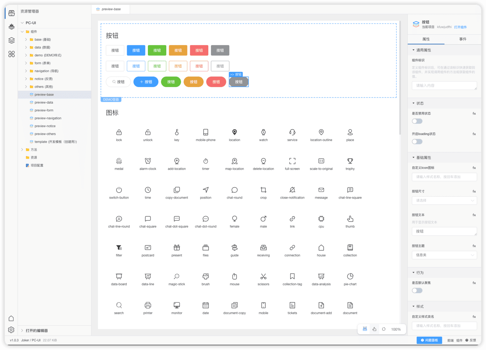
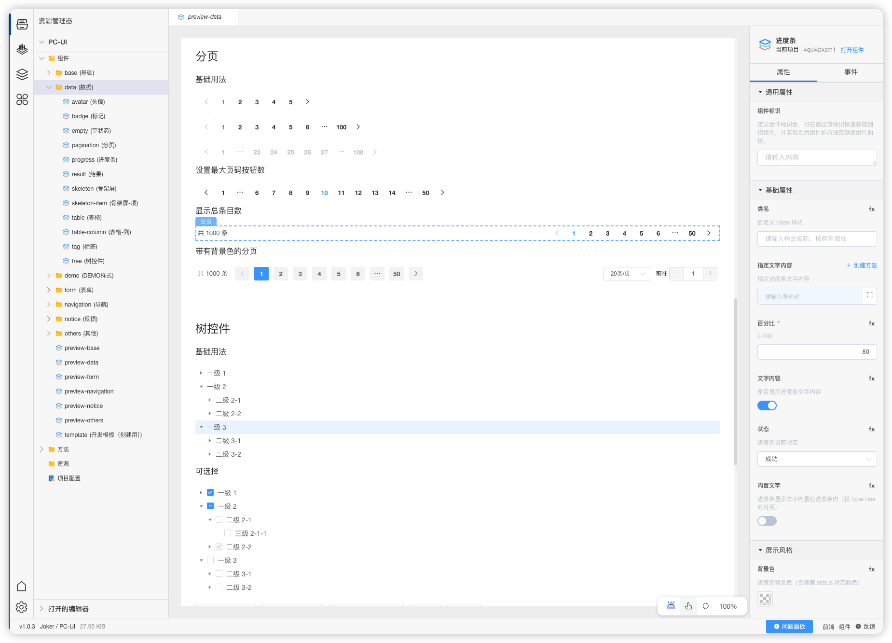
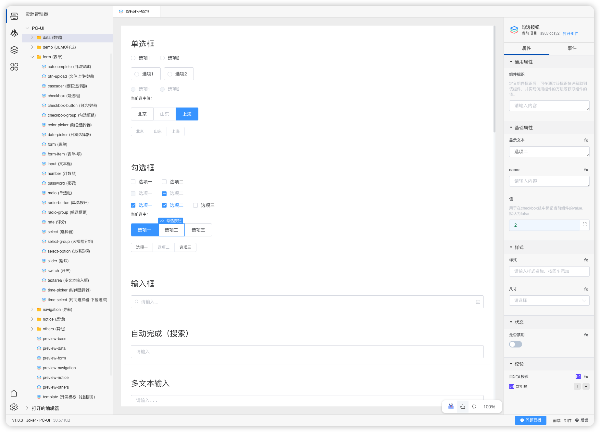

# Joker UI 

## Introduction

Joker UI is a UI component library that is meticulously crafted for front-end development. Its aim is to significantly enhance development efficiency and guarantee an excellent user experience. It incorporates numerous advanced design concepts and development techniques, providing a solid and reliable foundation for constructing various modern web applications.

## Features

### Concise and Aesthetic

-   **Exquisite Visual Style**: Joker UI adopts a concise and modern design style with harmonious and fresh color combinations. From the overall layout to the detailed elements, everything is carefully designed and can effortlessly integrate into different types of projects. Whether it's a simple and stylish commercial website or a complex enterprise-level application, it can display its unique charm and professional demeanor.
-   **Intuitive Interaction Design**: The interaction design follows the principle of user-friendliness, emphasizing the convenience and smoothness of user operations. For example, the click feedback of buttons, the input prompts of forms, and the expansion and collapse effects of menus have all been repeatedly optimized, enabling users to understand and operate them naturally during use, thus reducing the learning cost and improving work efficiency.

### Highly Flexible

-   **Rich Variety of Components**: It covers many common UI components such as buttons, input boxes, dropdown menus, tables, pop-up windows, etc. Moreover, each component has multiple styles and function variants to meet the diverse requirements in different scenarios. Taking the table component as an example, it not only supports basic data display and sorting functions but also enables convenient custom column rendering, data filtering, and pagination processing and other advanced operations.
-   **Powerful Customization Capability**: It provides comprehensive and easy-to-use customization interfaces, allowing developers to deeply customize the style, behavior, and function of components according to the specific style and requirements of the project. Whether it's adjusting the size, color, font of the components or modifying their internal interaction logic, it can be easily achieved through simple configuration or a small amount of code writing, thereby ensuring that the UI perfectly matches the overall style of the project.

### Excellent Performance

-   **Efficient Code Architecture**: During the code writing process, performance optimization is fully considered. It adopts efficient data processing algorithms and rendering mechanisms, which can quickly respond to user operation requests, reducing page loading time and rendering delay. Even when dealing with large-scale data or complex page layouts, it can maintain stable performance, providing users with a smooth browsing experience.
-   **Lightweight Resource Occupation**: The library files have been carefully compressed and optimized, with a small volume. When introduced into a project, it will not cause an excessive burden on the overall size of the project. At the same time, it can effectively reduce network transmission costs and improve page loading speed, especially suitable for mobile applications and large web projects with high performance requirements.

### Good Compatibility

-   **Compatibility with Mainstream Browsers**: After strict testing, it can perfectly be compatible with all current mainstream browsers, including Chrome, Firefox, Safari, Edge, etc. This ensures that the display effect and function of UI components remain consistent in different browser environments, avoiding compatibility issues caused by browser differences and providing users with a stable and reliable usage experience.

## Installation

### npm Installation

Execute the following command in the terminal:

```bash
npm install @joker.front/ui
```

This command will automatically download and install the Joker UI library and its related dependencies from the npm repository into the node_modules directory of the project.

### pnpm Installation

If you use the pnpm package manager, run the following command:

```bash
pnpm add @joker.front/ui
```

pnpm will handle the dependency installation process and ensure that the library files are correctly added to the project structure.

## Usage

### Global Introduction

In the entry JavaScript file of the project (such as main.js or app.js):

```js
import "@joker.front/ui";
import "@joker.front/ui/index.css";
```

## Low-Code Visualization

Currently, the UI library has been successfully migrated in the Joker Intelligent Development Platform and already supports low-code visual development capabilities. [Repository Address](https://lowcode.jokers.pub/#/repository/fcaf7ad3-c7d5-45fb-9ec9-7ffd29fb44f4)





[Low-Code Component Issue Feedback](https://lowcode.jokers.pub/index.html#/.repository/fcaf7ad3-c7d5-45fb-9ec9-7ffd29fb44f4/issues)

## Community Interaction

Welcome to join our active community forum. Here, you can exchange experiences, share insights, discuss technical issues, and obtain the latest development information with other Joker UI users. Community Address: [Feedback Address](https://github.com/jokers-pub/joker-front-ui/issues)

## Related Documentation

[Official Website](https://www.jokers.pub)

[Help Documentation](https://ui.jokers.pub)

[Low-Code Platform](http://jokers.pub)

# Joker UI

## 简介

Joker UI 是一款专门为前端开发精心打造的 UI 组件库，其目的在于极大地提升开发效率并保障出色的用户体验。它凝聚了众多先进的设计理念与开发技术，为构建各类现代 Web 应用提供了坚实可靠的基础。

## 特性

### 简洁美观

-   **精致视觉风格**：Joker UI 采用简洁而富有现代感的设计风格，色彩搭配协调且清新，从整体布局到细节元素，都经过精心雕琢，能够轻松融入各种类型的项目，无论是简约时尚的商业网站，还是功能复杂的企业级应用，都能展现出独特的魅力与专业气质。
-   **直观交互设计**：交互设计遵循人性化原则，注重用户操作的便捷性与流畅性。例如，按钮的点击反馈、表单的输入提示以及菜单的展开收起效果等，都经过反复优化，使用户在使用过程中能够自然地理解和操作，减少学习成本，提高工作效率。

### 高度灵活

-   **丰富组件种类**：涵盖了众多常见的 UI 组件，如按钮、输入框、下拉菜单、表格、弹窗等，并且每个组件都具备多种样式和功能变体，可满足不同场景下的多样化需求。以表格组件为例，不仅支持基本的数据展示与排序功能，还能方便地进行自定义列渲染、数据筛选以及分页处理等高级操作。
-   **强大定制能力**：提供了全面且易于使用的定制接口，允许开发者根据项目的特定风格和需求，对组件的样式、行为以及功能进行深度定制。无论是调整组件的尺寸、颜色、字体，还是修改其内部的交互逻辑，都可以通过简单的配置或少量的代码编写轻松实现，从而确保 UI 与项目整体风格完美契合。

### 性能卓越

-   **高效代码架构**：在代码编写过程中，充分考虑了性能优化，采用了高效的数据处理算法和渲染机制，能够快速响应用户的操作请求，减少页面加载时间和渲染延迟。即使在处理大规模数据或复杂页面布局时，也能保持稳定的性能表现，为用户提供流畅的浏览体验。
-   **轻量资源占用**：库文件经过精心压缩和优化，体积小巧，在引入项目时不会对项目的整体大小造成过大的负担，同时也能有效降低网络传输成本，提高页面的加载速度，尤其适合对性能要求较高的移动应用和大型 Web 项目。

### 兼容性佳

-   **主流浏览器适配**：经过严格测试，能够完美兼容当前主流的各类浏览器，包括 Chrome、Firefox、Safari、Edge 等，确保在不同浏览器环境下，UI 组件的显示效果和功能都能保持一致，避免因浏览器差异而导致的兼容性问题，为用户提供稳定可靠的使用体验。

## 安装

### npm 安装

在终端中执行以下命令：

```bash
npm install @joker.front/ui
```

此命令会自动从 npm 仓库下载并安装 Joker UI 库及其相关依赖到项目的 node_modules 目录中。

### pnpm 安装

如果您使用 pnpm 包管理器，运行以下命令：

```bash
pnpm add @joker.front/ui
```

pnpm 会处理依赖安装过程，确保库文件被正确添加到项目结构中。

## 使用

### 全局引入

在项目的入口 JavaScript 文件（如 main.js 或 app.js）中：

```js
import "@joker.front/ui";
import "@joker.front/ui/index.css";
```

## 低代码可视化

目前该 UI 库已在 Joker 智能开发平台中迁移完毕，已支持低代码可视化开发能力 [仓库地址](https://lowcode.jokers.pub/#/repository/fcaf7ad3-c7d5-45fb-9ec9-7ffd29fb44f4)


[低代码组件问题反馈](https://lowcode.jokers.pub/index.html#/repository/fcaf7ad3-c7d5-45fb-9ec9-7ffd29fb44f4/issues)

## 社区交流

欢迎加入我们活跃的社区论坛，在这里您可以与其他 Joker UI 用户交流经验、分享心得、探讨技术问题以及获取最新的开发资讯。社区地址：[反馈地址](https://github.com/jokers-pub/joker-front-ui/issues)

## 相关文档

[官网](https://www.jokers.pub)

[帮助文档](https://ui.jokers.pub)

[低代码平台](http://jokers.pub)
